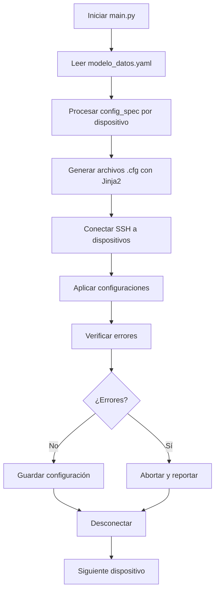

# Sistema de Automatización de Red con Netmiko y Jinja2

## Network Automation Engineer - UTNFRC

## Descripción General

Este proyecto implementa una solución avanzada de automatización de red que permite configurar múltiples dispositivos Cisco de forma completamente automatizada. Utiliza Python con las librerías Netmiko para conectividad SSH y Jinja2 para generación de configuraciones mediante plantillas. La arquitectura modular permite escalabilidad y mantenimiento sencillo.

## Metadatos del Proyecto

- **Proyecto**: Simulacro de Caso de Uso
- **Versión**: 1.0
- **Autor**: Ed Scrimaglia
- **Fecha de Creación**: 15 de Junio de 2025

## Arquitectura del Sistema

### Componentes Principales

1. **Script Principal (`main.py`)**: Coordina todo el flujo de automatización
2. **Clase ConfigDevices (`class_device_config.py`)**: Maneja conexiones y configuraciones de dispositivos
3. **Clase CreateConfig (`class_create_configs.py`)**: Gestiona creación de archivos de configuración y plantillas
4. **Modelo de Datos (`modelo_datos.yaml`)**: Define la infraestructura y configuraciones
5. **Plantillas Jinja2 (`templates/`)**: Templates para diferentes tipos de configuración

### Flujo de Trabajo



## Estructura Detallada del Proyecto

```tree
.
├── main.py                      # Script principal de orquestación
├── class_device_config.py       # Clase para gestión de dispositivos de red
├── class_create_configs.py      # Clase para creación de configuraciones
├── modelo_datos.yaml           # Modelo de datos de infraestructura
├── pyproject.toml              # Configuración del proyecto y dependencias
├── README.md                   # Esta documentación
├── configs/                    # Archivos de configuración generados
│   ├── SW_Bld_A_vlan.cfg      # Configuración de VLANs para SW_Bld_A
│   ├── SW_Bld_A_int_access.cfg # Interfaces de acceso para SW_Bld_A
│   ├── SW_Bld_A_int_trunk.cfg  # Interfaces trunk para SW_Bld_A
│   ├── SW_Bld_B_vlan.cfg      # Configuración de VLANs para SW_Bld_B
│   ├── SW_Bld_B_int_access.cfg # Interfaces de acceso para SW_Bld_B
│   └── SW_Bld_B_int_trunk.cfg  # Interfaces trunk para SW_Bld_B
└── templates/                  # Plantillas Jinja2
    ├── vlans.j2               # Template para configuración de VLANs
    ├── int_access.j2          # Template para interfaces de acceso
    └── int_trunk.j2           # Template para interfaces trunk
```

## Análisis Detallado de Componentes

### 1. Script Principal (`main.py`)

**Funcionalidades:**

- **Orquestación completa**: Coordina todas las fases del proceso
- **Medición de tiempo**: Calcula duración de configuración por dispositivo y total
- **Logging detallado**: Proporciona retroalimentación durante todo el proceso
- **Manejo de errores**: Implementa fail-fast para cada dispositivo

**Flujo de ejecución:**

1. **Inicialización**:

   ```python
   net_conf = ConfigDevices()      # Para conexiones de red
   create_config = CreateConfig()  # Para generación de configuraciones
   ```

2. **Lectura del modelo**:

   ```python
   dic_modelo = create_config.read_yaml("modelo_datos.yaml")
   ```

3. **Generación dinámica de configuraciones**:

   ```python
   for config in device.get("config_spec"):
       config_template = config.get("template")
       data_path = config.get("data_path")
       # Resolución dinámica de datos
       template = create_config.render_template(
           template_name=config_template, 
           data={data_path: device.get(data_path)}
       )
   ```

4. **Aplicación de configuraciones**:
   - Conexión SSH por dispositivo
   - Aplicación secuencial de archivos de configuración
   - Verificación de errores después de cada aplicación
   - Guardado de configuración si no hay errores

### 2. Clase ConfigDevices (`class_device_config.py`)

**Responsabilidades:**

- Gestión de conexiones SSH con dispositivos de red
- Envío de comandos de configuración
- Verificación de errores en salidas de comandos
- Guardado de configuraciones

**Métodos clave:**

```python
def connect_device(self, device_params: dict) -> ConnectHandler:
    # Establece conexión SSH usando parámetros del modelo
    
def send_config_commands(self, connection, config_file=None):
    # Envía configuración desde archivo a dispositivo
    
def check_output_error(self, output: str) -> bool:
    # Busca indicadores de error en salida de comandos
    error_indicators = ["% Invalid input", "% Incomplete command", "% Ambiguous command"]
    
def save_configuration(self, connection: ConnectHandler):
    # Ejecuta 'copy running-config startup-config'
```

**Manejo de Excepciones:**

- `NetmikoTimeoutException`: Timeout de conexión
- `NetmikoAuthenticationException`: Fallo de autenticación
- Errores genéricos de lectura/escritura

### 3. Clase CreateConfig (`class_create_configs.py`)

**Responsabilidades:**

- Renderizado de plantillas Jinja2
- Creación y escritura de archivos de configuración
- Lectura de archivos YAML
- Serialización JSON

**Métodos principales:**

```python
def render_template(self, template_name: str, data: any, template_dir: str = "./templates"):
    # Carga y renderiza plantilla Jinja2 con datos específicos
    loader = FileSystemLoader(template_dir)
    env = Environment(loader=loader)
    template = env.get_template(template_name)
    return template.render(data)

def guardar_config_file(self, filename: str, configuration: str):
    # Escribe configuración renderizada a archivo
    
def read_yaml(self, file_path: str) -> dict:
    # Lee y parsea archivo YAML del modelo de datos
```

### 4. Modelo de Datos (`modelo_datos.yaml`)

**Estructura jerárquica:**

```yaml
modelo:
  metadatos:
    proyecto: "Simulacro de Caso de Uso"
    version: "1.0"
    autor: "Ed Scrimaglia"
    fecha_creacion: "2025-06-15"
  
  infra_spec:
    devices:
      - hostname: "SW_Bld_A"
        management:
          ip: "X.X.X.X"
          interface: "GigabitEthernet0/0"
        connection:
          device_type: "cisco_ios"
          host: "X.X.X.X"
          username: "xxxx"
          password: "xxxx"
          global_delay_factor: 1
          ssh_config_file: "~/.ssh/config"
        interfaces:
          - name: "GigabitEthernet0/1"
            description: "Conexion a SW_CORE_1"
            mode: trunk
            trunk_mode: auto
            allowed_vlans: "10,20,30"
        vlans:
          - id: 10
            name: "Ingenieria"
          - id: 20
            name: "Produccion"
        config_spec:
          - data_path: "vlans"
            template: "vlans.j2"
            config_file: "vlan.cfg"
          - data_path: "interfaces"
            template: "int_trunk.j2"
            config_file: "int_trunk.cfg"
```

**Innovación: config_spec:**

La sección `config_spec` permite definir dinámicamente qué configuraciones generar:

- `data_path`: Referencia a los datos del dispositivo (`vlans`, `interfaces`)
- `template`: Plantilla Jinja2 a usar
- `config_file`: Nombre del archivo de salida

### 5. Plantillas Jinja2

#### Template de VLANs (`vlans.j2`)

```jinja
{# VLANs configuration template #}
!

vlan {{ vlan.id }}
  name {{ vlan.name }}
!

```

#### Template de Interfaces de Acceso (`int_access.j2`)

```jinja
{# Interface Access Configuration Template #}
!


interface {{ interface.name }}
  description {{ interface.description }}
  switchport mode {{ interface.mode }}
  switchport access vlan {{ interface.vlan }}
!


```

#### Template de Interfaces Trunk (`int_trunk.j2`)

```jinja
{# Interface Trunk Configuration Template #}
!


interface {{ interface.name }} 
  description {{ interface.description }}
  switchport {{ interface.mode }} encapsulation dot1q
  switchport mode dynamic {{ interface.trunk_mode }}
  switchport trunk allowed vlan {{ interface.allowed_vlans }}
!


```

## Topología de Red Configurada

El sistema configura una red con:

### Dispositivos

1. **SW_Bld_A** (10.2.0.10X)
2. **SW_Bld_B** (10.2.0.10X)

### VLANs (en ambos switches)

- **VLAN 10**: Ingenieria
- **VLAN 20**: Produccion  
- **VLAN 30**: Finanzas

### Interfaces por dispositivo

- **2 interfaces trunk**: Conexiones a switches core (GigabitEthernet0/1-2)
- **2 interfaces de acceso**: Conexiones a PCs (GigabitEthernet1/1-2)

## Dependencias y Requisitos

### Dependencias Python (pyproject.toml)

```toml
requires-python = ">=3.12"
dependencies = [
    "jinja2>=3.1.6",    # Motor de plantillas
    "netmiko>=4.6.0",   # Conexiones SSH a dispositivos de red
]
```

### Requisitos de infraestructura

- Dispositivos Cisco con SSH habilitado
- Conectividad IP a dispositivos de gestión
- Credenciales de acceso válidas

### 1. Clonar el Repositorio

```bash
git clone <repository-url>
cd sim_caso
```

### 2. Configurar Entorno Python

Usando `uv` (recomendado):

```bash
uv sync
```

### 2. Configuración del modelo

- Editar `modelo_datos.yaml` con datos de tu infraestructura
- Ajustar IPs, credenciales y configuraciones de dispositivos
- Modificar plantillas según necesidades específicas

### 3. Ejecución

```bash
python main.py
```

## Características Avanzadas

### 1. **Configuración Dinámica Basada en Especificaciones**

- El sistema usa `config_spec` para determinar qué configuraciones generar
- Permite agregar nuevos tipos de configuración sin modificar código
- Resolución dinámica de datos usando `data_path`

### 2. **Separación de Responsabilidades**

- **ConfigDevices**: Lógica de red y dispositivos
- **CreateConfig**: Generación de configuraciones y manejo de archivos
- **main.py**: Orquestación y control de flujo

### 3. **Manejo Robusto de Errores**

- Verificación de errores después de cada comando
- Sistema fail-fast que aborta ante errores críticos
- Logging detallado para debugging

### 4. **Medición de Rendimiento**

- Cronometraje por dispositivo y total
- Feedback en tiempo real del progreso
- Información detallada de cada operación

### 5. **Escalabilidad**

- Fácil agregar nuevos dispositivos al modelo YAML
- Templates reutilizables para diferentes configuraciones
- Estructura modular para extensiones futuras

## Casos de Uso Prácticos

### 1. **Despliegue Inicial de Red**

```bash
# Configurar múltiples switches desde cero
python main.py
```

### 2. **Actualización Masiva de Configuraciones**

- Modificar `modelo_datos.yaml`
- Re-ejecutar para aplicar cambios

### 3. **Estandarización de Configuraciones**

- Garantizar configuraciones consistentes
- Reducir errores de configuración manual

### 4. **Auditoría y Documentación**

- Los archivos generados sirven como documentación
- Historial de configuraciones aplicadas

## Monitoreo y Logging

El sistema proporciona feedback detallado:

```text
-> Starting Network Automation Configuration Device process...
-> Generating configuration files...
Creating configuration file 'SW_Bld_A_vlan.cfg' using template 'vlans.j2' for device 'SW_Bld_A'
Configuration files for SW_Bld_A created.

-> Configuration files available:
SW_Bld_A_int_access.cfg
SW_Bld_A_int_trunk.cfg
SW_Bld_A_vlan.cfg

-> Connecting to devices and applying configurations...
Connected to device 'SW_Bld_A' at IP '10.2.0.103'
Applying configuration from 'SW_Bld_A_vlan.cfg' for device 'SW_Bld_A'
Configuration from 'SW_Bld_A_vlan.cfg' applied successfully to device 'SW_Bld_A'
-> Configuration saved successfully on device 'SW_Bld_A' at IP '10.2.0.103'
-> Time taken to configure device 'SW_Bld_A': 0:00:15.234567
-> Total time taken to configure all devices: 0:00:32.456789
```

## Ejemplo de Archivos Generados

### Archivo de VLANs (`SW_Bld_A_vlan.cfg`)

```conf
!
vlan 10
  name Ingenieria
!
vlan 20
  name Produccion
!
vlan 30
  name Finanzas
!
```

### Archivo de Interfaces Trunk (`SW_Bld_A_int_trunk.cfg`)

```conf
!
interface GigabitEthernet0/1
  description Conexion a SW_CORE_1
  switchport trunk encapsulation dot1q
  switchport mode dynamic auto
  switchport trunk allowed vlan 10,20,30
!
interface GigabitEthernet0/2
  description Conexion a SW_CORE_2
  switchport trunk encapsulation dot1q
  switchport mode dynamic auto
  switchport trunk allowed vlan 10,20,30
!
```

## Flujo de Datos Detallado

### 1. **Lectura del Modelo**

```python
# El sistema lee modelo_datos.yaml y lo convierte en diccionario Python
dic_modelo = create_config.read_yaml("modelo_datos.yaml")
```

### 2. **Procesamiento por Dispositivo**

```python
for device in dic_modelo.get("modelo").get("infra_spec").get("devices"):
    hostname = device.get('hostname')
    # Para cada config_spec del dispositivo...
    for config in device.get("config_spec"):
        # Resuelve dinámicamente los datos
        data_path = config.get("data_path")
        data = device.get(data_path)  # Ej: device['vlans']
```

### 3. **Generación de Configuración**

```python
# Renderiza plantilla con datos específicos
template = create_config.render_template(
    template_name=config_template,
    data={data_path: device.get(data_path)}
)
```

### 4. **Aplicación en Dispositivo**

```python
# Conecta SSH y aplica configuración
connection = net_conf.connect_device(connection_params)
output = net_conf.send_config_commands(connection, config_file=config_file)
```

## Extensiones y Mejoras Futuras

### 1. **Funcionalidades Avanzadas**

- Backup automático antes de cambios
- Rollback en caso de fallas
- Validación de configuraciones pre-aplicación
- Soporte para más tipos de dispositivos (Juniper, Arista, etc.)

### 2. **Mejoras de Usabilidad**

- Interfaz web para gestión de configuraciones
- API REST para integración con otros sistemas
- Dashboard de monitoreo en tiempo real
- Notificaciones por email/Slack

### 3. **Características Enterprise**

- Integración con sistemas de gestión de cambios
- Logging avanzado con diferentes niveles
- Métricas y telemetría
- Soporte para configuraciones encriptadas

### 4. **Optimizaciones**

- Configuración paralela de dispositivos
- Cache de plantillas renderizadas
- Compresión de archivos de configuración
- Optimización de conexiones SSH

## Resolución de Problemas Comunes

### 1. **Error de Conexión SSH**

```text
NetmikoTimeoutException: TCP connection to device failed
```

**Solución**: Verificar conectividad IP y que SSH esté habilitado en el dispositivo.

### 2. **Error de Autenticación**

```text
NetmikoAuthenticationException: Authentication failed
```

**Solución**: Verificar credenciales en `connection` del modelo YAML.

### 3. **Error en Comando**

```text
% Invalid input detected at '^' marker
```

**Solución**: Revisar sintaxis en plantillas Jinja2.

### 4. **Archivo de Template No Encontrado**

```text
TemplateNotFound: vlans.j2
```

**Solución**: Verificar que el archivo existe en directorio `templates/`.

## Conclusiones

Este sistema representa una implementación profesional y escalable de automatización de red que:

- **Simplifica** la gestión de configuraciones de red
- **Estandariza** los procesos de despliegue
- **Reduce** errores humanos en configuraciones
- **Acelera** el tiempo de despliegue de infraestructura
- **Documenta** automáticamente las configuraciones aplicadas
- **Facilita** el mantenimiento y actualizaciones futuras

La arquitectura modular y el uso de estándares de la industria (YAML, Jinja2, Netmiko) hace que este proyecto sea una excelente base para implementaciones de automatización de red en entornos de producción.

### Beneficios Clave

1. **Automatización Completa**: Desde generación hasta aplicación
2. **Flexibilidad**: Sistema basado en configuración declarativa
3. **Escalabilidad**: Fácil agregar dispositivos y configuraciones
4. **Mantenibilidad**: Código modular y bien estructurado
5. **Observabilidad**: Logging detallado y medición de rendimiento
6. **Confiabilidad**: Manejo robusto de errores y validaciones

---

## Licencia

Proyecto educativo - UTN-FRC Academia Cisco - Network Automation Engineer Course

---

**Última actualización**: Diciembre 2025
